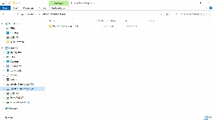

+++
title = "Programmieren"
date = "2021-10-26"
draft = false
pinned = false
description = "Eine Website zu gestalten und online zu stellen, ist tatsächlich viel leichter als ich dachte. Man benötigt einen Editor und einen Browser. Um die Arbeit zu vereinfachen nahmen wir einen Code-Editor.  Diesen Editor haben ich auf dem Datenträger (D) gespeichert. Mit der Programmiersprache, die mir bisher noch sehr unbekannt war, konnten wir verschiedenste Syntaxe eingeben und es entstand eine Website (siehe Bilder)."
+++

