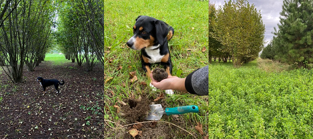
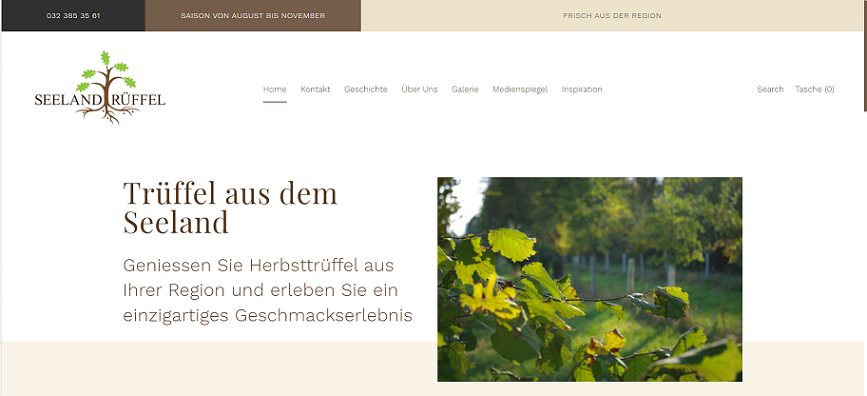
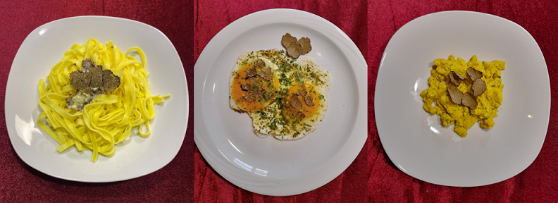

+++
title = "Semesterabschluss WEB-Projekt"
date = "2022-01-11"
draft = false
pinned = false
image = "bild1.jpg"
+++
## Idee & Kunden

Angéline und ich haben die Website Seeland Trüffel erstellt. Meine Eltern Ursula Eggli und Eduard Eggli besitzen zusammen mit Kollegen eine Trüffelanlage. Bereits schon vor dem WEB Unterricht verpflichtete ich mich, ihnen bei dem Erstellen einer Website zu helfen. Als Angéline und ich nur ein paar Wochen später ein Projekt brauchten, hatten wir unsere Kunden fast schon. Als meine Eltern das Einverständnis gaben, konnten wir loslegen.

## Von Anfängern zu Amateure

Der erste Schritt, um zu starten war die Auswahl eines Tools für die Gestaltung der Website. In Frage kamen Squarespace, Jimdo, Wix oder Shopify. Unsere Wahl fiel auf Shopify, weil das Preisleistungsverhältnis alle Beteiligten überzeugte. Sich in der App einzufinden war jedoch schwieriger als gedacht. Nach langem ausprobieren schauten wir ein sehr langes Youtube Video über Shopify. Dies war zehr zeitaufwändig, lohnte sich jedoch sehr. Dank dem Video und Marco, der uns bei Fragen immer weiterhelfen konnte, wurden wir schon bald richtige Shopify-Amateure. Wir taten uns auch ein bisschen schwierig mit der Theme Auswahl auf Shopify. letztendlich haben wir uns unter Absprache mit unseren Kunden für ein kostenpflichtiges entschieden. Ein Shopify Abo wurde gelöst und ich ging in die Trüffelanlage Fotos machen, um sie für die Website zu verwenden.

## "Endprodukt"

Am Schluss kam eine, meiner Meinung nach, anschauliche Website zu Stande. Wir zeigten die Website unseren Kunden immer wieder, damit sie auf dem neusten Stand waren und Sachen, die ihnen nicht gefielen, direkt erwähnen konnten. Auf der Webseite wird man den Herbsttrüffel aus dem Seeland bestellen können und auch einige Informationen über die Geschichte des tuber uncinatum (Herbsttrüffel) herausbekommen. Um zu veranschaulichen was man mit einem Trüffel alles machen kann, erstellten wir das Register Inspirationen mit leckeren Rezepten. Die Website ist zwar noch nicht aufgeschaltet, weil sie noch einige Feinschliffe benötigt, aber das wird sich auf den Sommer ändern.

## Fazit & Zukunft

Ich weiss nun, wie man ganz einfach mit Shopify eine Website erstellen kann, jedoch bin ich mit jedem Bearbeiten wieder Neues am dazu lernen. Die Website ist momentan pausiert, vor dem Aufschalten werde ich in meiner Freizeit zusammen mit meinen Eltern die Feinschliffe tätigen. Feinschliffe werden sein: Bilder der Beteiligten machen (Personen und Hunde), die Domain verknüpfen und einen Instagram Account erstellen.

Im Grossen und Ganzen war das Projekt ein Erfolg. Weil wir die Website ein bisschen zu früh fertig hatten, verursachte dies vermeidbare Kosten (Abo), deswegen würde ich beim nächsten Mal ein Zeitplan erstellen, um die Zeit besser einteilen zu können.

In Meinem nächsten Projekt will ich etwas machen, das einen Mehrwert für andere hat und meinen Interessen mehr entspricht. Auch wenn die Website zu gestalten eine spannende Erfahrung war, fehlt mir noch die Passion zum Thema.